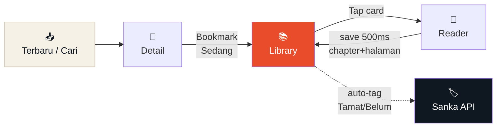
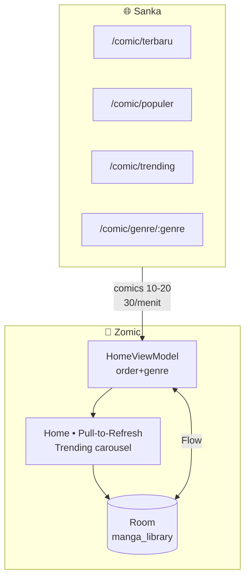
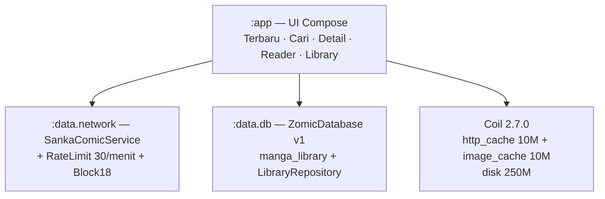

<div align="center">


# **Zomic**

### *Rak pustaka vertikal — manga auto-organizer di kantong.*

[](https://github.com/az925-crypto/Zomic/actions/workflows/build.yml)
[](https://github.com/az925-crypto/Zomic/releases)


**Manga reader yang hafal kamu lagi baca apa.**
Auto-tag `Tamat / Belum Tamat` dari API Sanka, kamu tinggal pilih `Sedang / Belum / Dropped` — library rapi 2 dimensi, lanjut baca < 3 tap.

[Fitur](#-kenapa-zomic) · [Tur Layar](#-tur-layar) · [Cara Pakai](#-mulai-60-detik) · [Arsitektur](#-arsitektur) · [API](#-api-sanka) · [Build](#-build--ci)

</div>

---

## 🎬 Cara Kerja





> [!IMPORTANT]
> **Library tetap bisa dibuka offline** saat API kena `429` / down. Rate limit `30/menit` dijaga ketat — jangan spam `pull-to-refresh`.

---

## ✨ Kenapa Zomic?

> **Bukan katalog e-commerce.** Rak pustaka vertikal ala toko Jimbocho — tiap buku punya punggung `4dp` yang mendorong mata ke bawah, bukan grid 3-kolom.

| 📚 Auto Organizer | 🎨 Spine Strip | 🔎 Discovery Beneran |
|---|---|---|
| Status publikasi `Tamat/Belum` auto dari Sanka (`End`/`Ongoing`). Kamu cuma atur `Sedang / Belum / Dropped`. | `Hanko merah = Sedang Dibaca` · `Abu = Belum` · `Striped = Dropped` + dot `● Tamat / ○ Ongoing`. Data, bukan hiasan. | `Terbaru` `Populer` `Trending` `Berwarna` + 24 genre `Action → Isekai` — semua ada data (bukan `Manga/Manhwa` kosong). |

Estetika **Paper Ivory #F6F1E7 60% / Sumi #0F1720 30% / Hanko #E84C2A 10%** — kertas menguning + tinta sumi-e + cap hanko. Font `Fraunces` + `Plus Jakarta Sans` + `JetBrains Mono` (2 + 1).

---

## 🧭 Tur Layar

| Layar | Apa yang kamu lihat | Signature |
|---|---|---|
| **Home** | `Terbaru / Populer / Trending / Berwarna` + 24 genre chip + carousel `Trending hari ini` + `Pull-to-Refresh` | `tarik ↓ untuk muat ulang`, shimmer 5, pill `GET /comic/...` |
| **Cari** | Debounce `450ms` + cache `10m` + recent chips `one piece · naruto` + highlight kuning | `q=naruto → 4 ditemukan` |
| **Detail** | Hero `300dp` gradient + ledger `PROGRESS LEDGER — — — ● — — —` + `62%` + synopsis + chapter list `56dp` | `Sumber tidak tersedia` banner bila hilang dari API |
| **Reader** | Dark `Sumi` overlay `48dp` + page `3:4.2` + gutter dashed + scrub `64dp` + `P.04/19` | `Coil 250MB` + retry per halaman + save `500ms` |
| **Library** | Filter 2D `readingStatus × publicationStatus` + count + section `SEDANG (2)` + progress `68%` | `Dropped` grayscale + long-press → sheet |

<details>
<summary><b>📸 Mockup (8 frame) — klik untuk expand</b></summary>

Mockup HTML full-app ada di [`mockups/index.html`](mockups/index.html) — gate sebelum Compose.

```bash
python3 -m http.server 8000 --directory mockups --bind 127.0.0.1
# buka http://127.0.0.1:8000
```

> `S1 Terbaru · S2 Cari · S3 Detail · S3b Tamat · S4 Reader · S5 Library · S5b Empty · Error 429`

</details>

---

## 🚀 Mulai 60 Detik

```text
1️⃣  Install APK terbaru → Releases → Zomic-v1.x.x-release.apk
2️⃣  Buka Home → pilih order Terbaru/Populer/Trending atau genre Action/Fantasy
3️⃣  Tap card → Detail → Bookmark "Sedang Dibaca"
4️⃣  Tap "Lanjut Baca Ch. 43" → Reader → swipe vertikal
5️⃣  Balik ke Library → tap lagi → langsung lanjut halaman terakhir (< 3 tap)
```

<details>
<summary><b>📦 Build & Rilis (Termux → GitHub Actions)</b></summary>

Build berat **hanya via GitHub Actions** (note.txt) — tidak ada SDK lokal:

```bash
git push origin main                # CI: testReleaseUnitTest → assembleRelease
gh run list --limit 1               # cek status
gh run view <id> --log-failed       # kalau merah, lihat errornya

# Rilis versi baru:
# 1. commit + push, tunggu CI hijau
git tag v1.0.3 && git push origin v1.0.3   # workflow upload APK + .sha256 otomatis
```

Signing: set `secrets.KEYSTORE_BASE64` + `KEYSTORE_PASSWORD` + `KEY_ALIAS` + `KEY_PASSWORD` — fallback debug jika tidak ada. Artifact `Zomic-v1.0.0-release.apk` + `.sha256` di Releases (tag `v*`).

</details>

---

## 🏗️ Arsitektur



<details>
<summary><b>📂 Struktur folder — klik untuk expand</b></summary>

```text
com.zaaamzomic/
├── ZomicApp.kt              AppContainer (DB + OkHttp + Retrofit + Coil)
├── data/
│   ├── network/             SankaComicService, SankaModels, RateLimitInterceptor, Block18Interceptor
│   └── db/                  ZomicDatabase, MangaEntity, MangaDao, LibraryRepository
├── ui/
│   ├── theme/               Color.kt (PaperIvory/Sumi/Hanko), Theme.kt, Type.kt
│   ├── components/          MangaSpineCard (+ Compact), FilterChips, BookmarkSheet
│   └── screens/             TerbaruScreen (Home), SearchScreen, DetailScreen, ReaderScreen, LibraryScreen
├── navigation/              ZomicNav (terbaru/cari/detail/chapter/library)
└── res/mipmap-*/            ic_launcher (foto asli 1024) + adaptive foreground
```

</details>

| Komponen | Teknologi |
|---|---|
| UI | Jetpack Compose + Material 3 + Navigation 2.8.5 |
| Database | Room 2.6.1 + KSP |
| Network | Retrofit 2.9.0 + OkHttp 4.12.0 + kotlinx.serialization |
| Image | Coil 2.7.0 (`coil-compose-base`) + OkHttp ImageLoader 250MB |
| Build | AGP 8.7.3 · Kotlin 2.0.21 · compileSdk 35 · minSdk 26 · Gradle 8.10 |

---

## 🌐 API Sanka

Base `https://www.sankavollerei.web.id` — gratis, `30 request / menit / IP` (3x → BAN permanen), tanpa key wajib.

| Endpoint | Dipakai untuk | Catatan |
|---|---|---|
| `GET /comic/terbaru` | Home `Terbaru` | `comics 10` + `time_ago` |
| `GET /comic/populer` | Home `Populer` | `comics 10` ranking |
| `GET /comic/trending` | Home `Trending` + carousel | `trending 20` |
| `GET /comic/genres` | Chip genre | `24` value/name |
| `GET /comic/genre/:genre` | Filter genre | `comics 10` per genre |
| `GET /comic/berwarna/:page` | Home `Berwarna` | `results` + `type: Manhwa` |
| `GET /comic/search?q=` | Cari | debounce `450ms` |
| `GET /comic/comic/:slug` | Detail | `metadata.status End` → `TAMAT` |
| `GET /comic/chapter/:slug` | Reader | `images[]` + navigation |

> Validasi live di [`docs/api-validation.md`](docs/api-validation.md) & [`CATATAN_API_SANKA.md`](CATATAN_API_SANKA.md). Browse `/comic/type/:type` & `/comic/browse` saat ini `0` — jangan dipakai.

---

## 🔒 Keamanan & Privasi

- **Tanpa analytics** — `INTERNET` hanya untuk Sanka + thumbnail `https://` (validasi scheme)
- **Block 18+** — `Block18Interceptor` image-only, metadata tetap tampil tapi gambar diblok
- **RateLimit** — token bucket `30/60s` + `SystemClock.elapsedRealtime` + single `Thread.sleep` + retry `429`
- **Offline-first Library** — `allowBackup=false` + `dataExtractionRules`

---

## ❓ FAQ

<details>
<summary><b>Home kok kosong? Cuma "Semua" ada isi?</b></summary>
Sudah fix di `v1.0.2` — filter `Manga/Manhwa` lama `type=null` selalu kosong. Sekarang pakai `Terbaru/Populer/Trending/Berwarna` + 24 genre yang semua ada data.

</details>

<details>
<summary><b>Ga bisa relog / pull-to-refresh?</b></summary>
Tarik dari atas Home (indikator `Hanko`) atau tap ikon ↻ di TopBar. Jangan spam — `30/menit` dijaga, `Coba Lagi` disable saat `429`.

</details>

<details>
<summary><b>Gambar tidak muncul?</b></summary>
Hanya `https://` yang diizinkan (Coil). `http` di-filter demi keamanan. Cek koneksi & coba tap `Muat Ulang Halaman` per halaman di Reader.

</details>

<details>
<summary><b>Build lokal gagal `sdkmanager not found`?</b></summary>
Wajar — build berat wajib via GitHub Actions (sesuai `note.txt`). CI pakai `JDK 17` + `gradle/actions/setup-gradle@v4` → `testReleaseUnitTest` + `assembleRelease`.

</details>

---

## 🎨 Icon

Foto asli `1024×1024` dari [Ideogram](https://ideogram.ai/g/Sxcbx_O6RZ2NcYQzC4TO5w/1) (`svGlRxvFVOSFlM8FIGEFsA`) — flat vector cream comic page + spine `Hanko`. Di-resize ke `48/72/96/144/192` + `round 22%` + adaptive foreground `108..432` (`mipmap-anydpi-v26/ic_launcher.xml → @mipmap/ic_launcher_foreground`).

---

<div align="center">

**Package** `com.zaaamzomic` · **Repo** [az925-crypto/Zomic](https://github.com/az925-crypto/Zomic) · **License** MIT

*Dibuat di Termux, di-build di GitHub Actions, dibaca di mana aja.*

</div>
